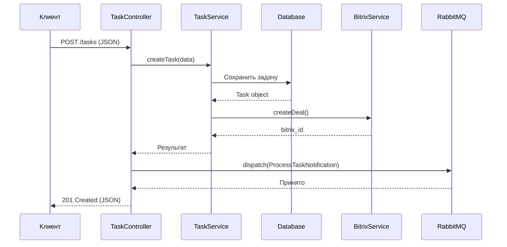

# Laravel Demo: Интеграция с 1С-Битрикс и RabbitMQ

## Особенности реализации
- **Многослойная архитектура**: Controller -> Service -> Repository
- **Асинхронная обработка**: Очереди через RabbitMQ
- **Интеграция с 1С-Битрикс**: REST API + кеширование
- **Поиск**: Elasticsearch через Laravel Scout
- **Тестирование**: Feature-тесты с моками внешних сервисов
- **Безопасность**: Валидация, подготовленные SQL-запросы

## Технологии
- Laravel 10
- RabbitMQ
- 1С-Битрикс API
- MySQL

## Запуск проекта
```bash
# С Docker
docker-compose up -d
docker-compose exec app composer install
docker-compose exec app php artisan migrate

# Без Docker
composer install
php artisan serve

## Архитектура системы

### Диаграмма последовательности


### Структура классов
